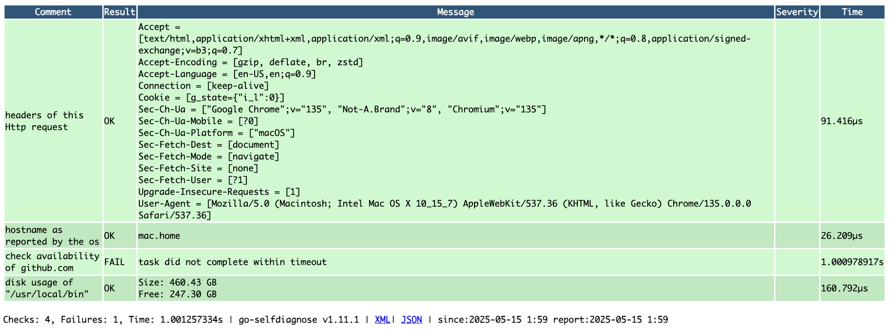

# SelfDiagnose

SelfDiagnose is a package of diagnostic tasks that can verify the availability of external resources required for the execution of a Go application.

This is a simplified port of its [Java implementation](https://github.com/emicklei/selfdiagnose/).

## Example

## Usage
    
    // register standard and custom tasks
	selfdiagnose.Register(task.ReportHttpRequest{})

    // serve diagnose page
    http.HandleFunc("/selfdiagnose", selfdiagnose.HandleSelfdiagnose)

(c) 2025, http://ernestmicklei.com. Apache v2 License